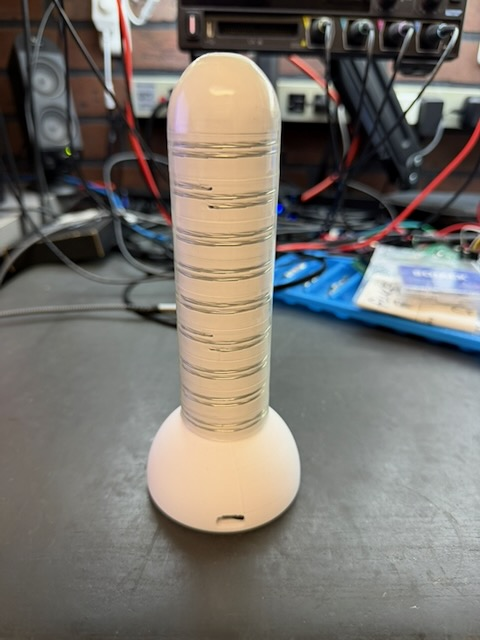
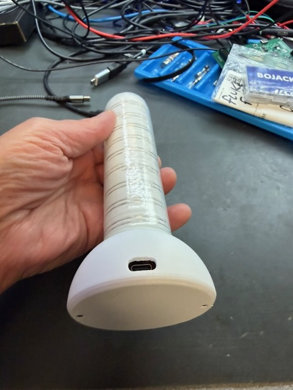
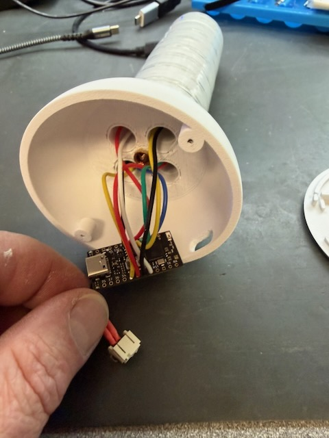
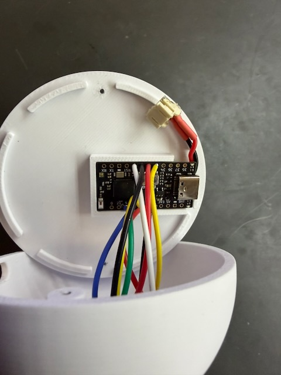

# The (as yet unnamed) Teledildonic Input Device
## What it is
A phallic-shaped capacitive touch input device with nine sensors spaced along its length.  It is built around an [Unexpected Maker TinyS3](https://unexpectedmaker.com/shop.html#!/TinyS3/p/577100914) (ESP32-S3), nine 3D-printed electrode spacers threaded onto an M6 rod, and a small LiPo battery — all assembled into an enclosure made of 3D-printed parts.

The finished assembly must be covered with a non-conductive layer at least 1mm thick. I used adhesive-wall heat-shrink tubing for this (and will use condoms with it for insertion, as the heat-shrink tubing is not known to be body-safe). A better alternative would be to use body-safe silicone.

The nine electrodes are bare loops of tinned wire wound around the outside of each spacer.  Each is connected to one of the ESP32-S3's capacitive-touch GPIO pins.  When the device is touched, gripped, or inserted, the capacitance on the covered electrodes increases and the firmware converts those changes into the metrics described below.



## What it does
The firmware continuously reads all nine touch electrodes and derives three summary values, each expressed as percentages (0-100):

| Value | Meaning |
|---|---|
| **insertion** | How many sensors are engaged, and how strongly. Rises toward 100 as more of the shaft is covered or pressure increases. |
| **focus** | How concentrated the activity is. High (near 100) when only one or two sensors are active; zero when all sensors are equally active. |
| **center** | Weighted-average position of touch activity along the shaft: 0 = base, 100 = tip. |

Raw readings are normalized per-sensor using a two-phase calibration that captures each sensor's idle baseline and peak touch range.  Calibration data is stored in `/calibration.json` on the device's flash filesystem and survives reboots.

What you do with those values is up to you. There is old code here that used the ESPNow protocol to communicate to an LED box for a demo.
You will probably want to do something different.

## The firmware
The firmware is written in MicroPython running on the TinyS3.  The relevant source files are in `src/` here, and in the root of the flash filesystem on the device:

| File | Purpose |
|---|---|
| `touch_sensor.py` | `MultiTouchSensor` — configures the nine `TouchPad` objects and provides synchronous (`read`) and async (`read_async`) raw-value reads. |
| `touch_analysis.py` | `TouchAnalyzer` — wraps `MultiTouchSensor` with two-phase calibration, per-sensor normalization, and the `insertion`, `focus`, and `center_of_activity` metrics. |
| `config.py` | Pin assignments, touch threshold, and shared helpers. |
| `main.py` | Entry point: prompts for calibration if none is saved, then runs the output loop. |

### Calibration
Calibration is two-phase and interactive:

1. **Rest phase** (default 3 s) — set the device on a surface and do not touch it.  The firmware records the idle baseline for each sensor.
2. **Handle phase** (default 10 s) — pick up and handle the device naturally, making sure to touch the full length of the shaft.  The firmware records the peak touch response for each sensor.

The resulting offset and scale per sensor are saved to `/calibration.json`.  Delete that file (or answer `y` at startup with no calibration present) to recalibrate.

### Async design
All sensor reads use `asyncio.sleep_ms` between individual pin reads, so the loop never blocks for more than ~30 ms per pin.  The main output loop runs at approximately 100 ms intervals and yields control between iterations, making it easy to integrate with other async tasks.
## Building
### Parts required
  - 3D printed parts (see below)
  - 155mm length of M6 threaded rod
  - 2x M6 threaded inserts
  - 2x 1.5mm x 6mm long plastic screws
  - Unexpected Maker TinyS3
  - Flexible stranded hookup wire, ideally solderable and in different colors (I used 24AWG silicone wire)
  - Li-poly cell (I used a 400mAh one that fit; check space available in model or 3D print)
  - Solid tinned or silver-coated wire, 20-22 AWG. Make sure that this is solderable (much "craft wire" is enameled and so not easily soldered).
  - Length of ~41mm diameter adhesive-wall heat-shrink tubing (optional, for holding everything together and helping make it waterproof.) Or you could just coat the whole thing with body-safe silicone.
  - Hot glue, UV resin, or other filler for the top of the heat-shrink tubing (if you're using it).
### Tools and supplies required
  - Soldering iron and solder
  - Heat setting tool for threaded inserts (or use your soldering iron)
  - Wire stripper
  - Needlenose pliers
  - Low- or medium-strength thread locker (green or blue)
  - Binder clip to hold the spacers in place during assembly (or you can use masking tape pieces)
  - If you're using the heat shrink tubing around the shaft:
    - Heat gun
    - Scissors
    - Hot glue gun, UV curing lamp, or other tools for the end filler.
### 3D Print
Print the following parts (models in the `hardware/` directory):
  - 9x `spacer`
  - 1x `top`
  - 1x `base`
  - 1x `base_cover`
### Attach threaded inserts
Use a soldering iron or similar to melt the threaded inserts into the `top` and `base` parts.
### Making the sensors
Make 9 sensors:
  - Insert the end of your solid wire into one of the two holes on the side of the `spacer`.
  - Twist the end into a loop. You will be soldering to this loop.
  - Pass the wire around the spacer, keeping it tight
  - Bend the wire sharply so it can pass through the other hole.
  - Cut the wire about 2cm from the bend
  - Insert the cut end into the hole
  - Bend it over or twist it into a loop
### Final Assembly
Start at the base.
  - Thread the M5 rod into the base. If you have threadlocker, use a dab of it here.
  - For each of the nine sensors:
    - Slide the next `spacer` (wired with solid wire) over the threaded rod (it helps to glue the first one to the base).
    - Rotate it so that the four holes line up with the ones in the base and other sensors and the ends of the solid wire are positioned 90 degrees clockwise from the prior one. This will ensure that a single one of the 4 channels won't get over-filled with hookup wire.
    - Clip the binder clip onto the threaded rod just above the spacer. This will keep it in place while you're working on it. If you don't have a binder clip, you can use a piece of masking tape to stick it to the prior sensor.
    - Solder the stripped end of a piece of hookup wire to the end of the solid wire
    - Cut the hookup wire long enough to reach the base cover plus 3cm or so
    - Strip the cut end of the hookup wire about 2-3mm.
    - Insert the hookup wire into the next GPIO pad of the TinyS3 (start at GPIO0)
    - Solder the wire onto the TinyS3 board



    - Add a wired JST connector for your battery if you're using one. Solder the wires under the board to the battery contacts.


  - Thread the `top` on, using threadlocker if you want.
  - If you're using heat-shrink tubing:
    - Cut a piece of tubing somewhat longer than the distance from the base to the tip. It will shrink quite a bit when heated, so be generous. You will trim the excess later.
    - Heat the heat shrink tubing evenly, making sure that the bottom is flush with the base and the top shrinks evenly.
    - While the tubing is still soft, trim the excess on the end with a pair of scissors or scalpel.
    - Fill in the bare spot at the end with hot melt glue, UV resin, or other substance so it's flush with the cut end of the heat shrink tubing.
## Installing the firmware
  - Install MicroPython from the [micropython.org website](https://micropython.org/download/UM_TINYS3/)
  - Install `mpremote` (or you can use `rshell`, `Thonny`, etc.)
  - Copy the contents of `src/` (and `src/lib`) to the root of the filesystem:
    ```bash
    mpremote cp -r src/* :/
    ```
  - The first time you run the firmware, you will be prompted to create a calibration file.
  - You can remove '/calibration.json' from your flash filesystem to be prompted again.
  - Test by running ```mpremote repl```:
  ```bash
  [OEngineer/teledildonics_input_device] % mpremote repl
  Connected to MicroPython at /dev/cu.usbmodem3144101
  Use Ctrl-] or Ctrl-x to exit this shell
  <ctrl-D>
  MPY: soft reboot
  No valid calibration found; using defaults.
  Do you want to calibrate now (y/n)?y
  Phase 1 (3 s): set the device down - do not touch it.
  Press Enter to start rest phase...
  Press Enter to start handling phase...
  Phase 2 (10 s): stroke, fondle, and handle the device now.
  Calibration done.
    offsets: [25714, 25038, 26755, 26214, 24746, 26703, 26815, 29324, 28949]
    scales:  [7910, 10332, 11986, 12678, 11635, 9600, 11263, 11661, 13998]
  Calibration saved.
  focus: 0 insertion: 88 center: 51
  focus: 0 insertion: 89 center: 52
  ...
  ```
## Using it
I recommend coating the device with body-safe silicone after it's working, or at least using a condom around it if you're going to be inserting it.